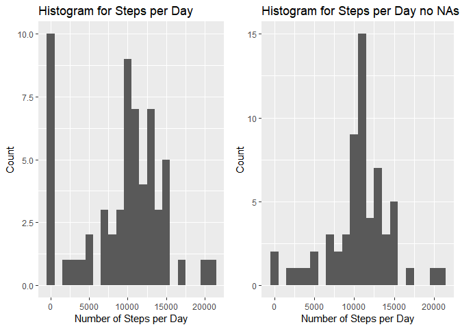

## Loading and preprocessing the data

Let's load our libraries and data

```r
library(ggplot2)
library(lattice)
library(gridExtra)
library(dplyr)
```

```
## 
## Attaching package: 'dplyr'
```

```
## The following object is masked from 'package:gridExtra':
## 
##     combine
```

```
## The following objects are masked from 'package:stats':
## 
##     filter, lag
```

```
## The following objects are masked from 'package:base':
## 
##     intersect, setdiff, setequal, union
```

```r
df <- read.csv("activity.csv")
```
  
Now for some initial exploration

```r
head(df)
```

```
##   steps       date interval
## 1    NA 2012-10-01        0
## 2    NA 2012-10-01        5
## 3    NA 2012-10-01       10
## 4    NA 2012-10-01       15
## 5    NA 2012-10-01       20
## 6    NA 2012-10-01       25
```

```r
str(df)
```

```
## 'data.frame':	17568 obs. of  3 variables:
##  $ steps   : int  NA NA NA NA NA NA NA NA NA NA ...
##  $ date    : Factor w/ 61 levels "2012-10-01","2012-10-02",..: 1 1 1 1 1 1 1 1 1 1 ...
##  $ interval: int  0 5 10 15 20 25 30 35 40 45 ...
```

```r
dim(df)
```

```
## [1] 17568     3
```

The date variable is factor, lets convert it to a date. 


```r
df$date <- as.Date(df$date, format = "%Y-%m-%d")
```

## What is mean total number of steps taken per day?


```r
dfsum <- with(df,tapply(steps, date, sum, na.rm = T))
qplot(dfsum, geom="histogram", binwidth=1000, xlab = "Number of Steps per Day", ylab="Count", main="Histogram for Steps per Day")
```

<!-- -->

```r
cat("Mean Steps per Day", mean(dfsum))
```

```
## Mean Steps per Day 9354.23
```

```r
cat("Median Steps per Day", median(dfsum))
```

```
## Median Steps per Day 10395
```

The mean total number of steps per day is **9354.2295082**   
The median total number of steps per day is **10395**

## What is the average daily activity pattern?


```r
im <- aggregate(steps~interval,data=df,FUN="mean", na.action = na.omit)
ggplot(im, aes(x=interval, y=steps)) + 
    geom_line() +
    labs(x="Interval", y="Average Steps", title="Average Steps per Interval")
```

<!-- -->

```r
cat("Max Interval", im[which.max(im$steps),]$interval)
```

```
## Max Interval 835
```
  
The 5 minute interval with most steps is interval **835**

## Imputing missing values


```r
summary(df)
```

```
##      steps             date               interval     
##  Min.   :  0.00   Min.   :2012-10-01   Min.   :   0.0  
##  1st Qu.:  0.00   1st Qu.:2012-10-16   1st Qu.: 588.8  
##  Median :  0.00   Median :2012-10-31   Median :1177.5  
##  Mean   : 37.38   Mean   :2012-10-31   Mean   :1177.5  
##  3rd Qu.: 12.00   3rd Qu.:2012-11-15   3rd Qu.:1766.2  
##  Max.   :806.00   Max.   :2012-11-30   Max.   :2355.0  
##  NA's   :2304
```

There are 2304 NA's in the steps columns out of 17,568. That is roughly **0.1311475** or 13%. 


```r
head(df[is.na(df$steps),])
```

```
##   steps       date interval
## 1    NA 2012-10-01        0
## 2    NA 2012-10-01        5
## 3    NA 2012-10-01       10
## 4    NA 2012-10-01       15
## 5    NA 2012-10-01       20
## 6    NA 2012-10-01       25
```
Lets replace the NAs with the average

```r
ndf <- df
ndf[is.na(ndf)] <- mean(df$steps,na.rm=T)
```
With the NA removed lets look at the data again.

```r
ndfsum <- with(ndf,tapply(steps, date, sum, na.rm = T))
p1 <- qplot(dfsum, geom="histogram", binwidth=1000, xlab = "Number of Steps per Day", ylab="Count", main="Histogram for Steps per Day")
p2 <- qplot(ndfsum, geom="histogram", binwidth=1000, xlab = "Number of Steps per Day", ylab="Count", main="Histogram for Steps per Day no NAs")
grid.arrange(p1, p2, nrow = 1)
```

<!-- -->

```r
cat("Mean Steps per Day", mean(dfsum), " with no NAs ", mean(ndfsum))
```

```
## Mean Steps per Day 9354.23  with no NAs  10766.19
```

```r
cat("Median Steps per Day", median(dfsum), " with no NAs ", median(ndfsum))
```

```
## Median Steps per Day 10395  with no NAs  10766.19
```

The new mean is 1.0766189\times 10^{4} which is the same as the median 1.0766189\times 10^{4}

## Are there differences in activity patterns between weekdays and weekends?


```r
ndf <- tbl_df(ndf)
ndf <- ndf %>% mutate(wkdy = factor(case_when( weekdays(ndf$date) %in% c("Sunday","Saturday") ~ "weekend", TRUE ~ "weekday")))
ndfp <- aggregate(steps~interval + wkdy, data=ndf, FUN="mean")
with(ndfp,xyplot(steps~interval | wkdy, type="l", ylim=c(),scales=list(y=list(relation="free")),layout=c(1,2)))
```

<!-- -->
